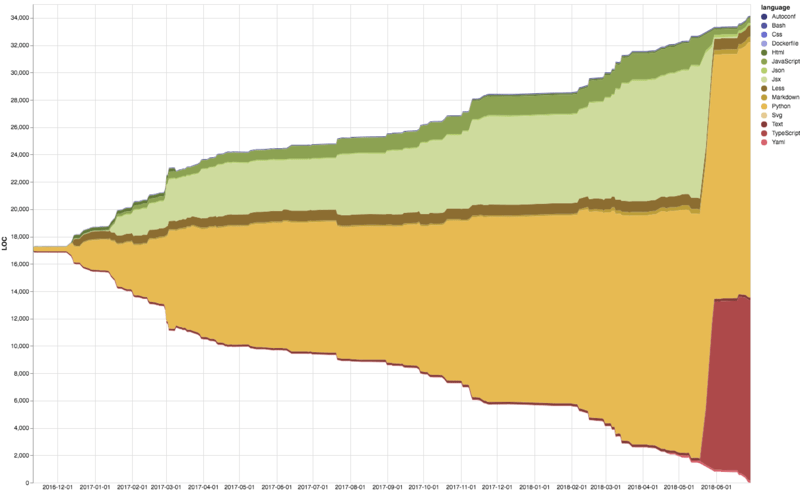

repose
======

> Visualize the evolution of a Git repository's languages and size

You, too, can have your repository visualized like this!

Usage
-----

* Repose uses [Tokei][tokei] for LOC calculations, so you need it installed and on your path.
  **If you're compiling Tokei by yourself, make sure JSON serialization is enabled.**
  
* Create a Python 3 virtualenv or something, then `pip install -r requirements.txt`.

* Run `python3 -m repose scan -d my-repo.sqlite3 my-repo-path`.
* Run `python3 -m repose chart my-repo.sqlite3`.
* Open `chart.html`. Yay!

Tips
----

* By default, the repo is scanned at a 1 day interval. You can pass in `-r` (for "resolution")
  to change this, e.g. `-r 1w` for a week, etc. This also works for `chart`.
* You can hang on to the database file to avoid having to rescan all of the repository's history.
* Thanks to Tokei's data format, the database contains per-file statistics too (though there is no visualizer for those yet). Maybe you can think of something to do with them?

[tokei]: https://github.com/Aaronepower/tokei
